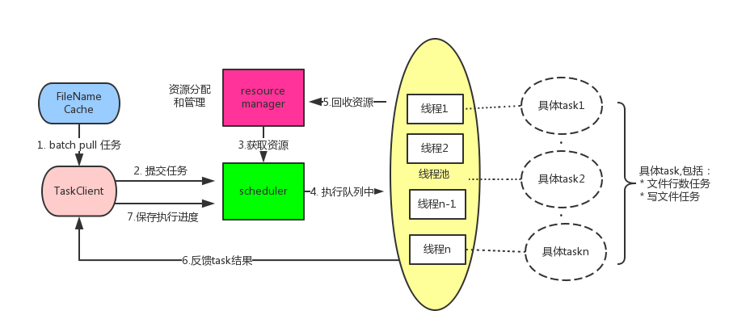

FileReadWork
========
 
#### 问题描述及思考
输入：1000000个小文件，每个大小平均几兆，总共文件大小有几T，每个文件名时间戳

输出：同样的文件个数，只是每行数据前要加一个行号标识。每个文件行号起始是从上一个临近文件（根据文件名的时间戳）的结尾标号开始。

##### 需求条件确认：

1. 文件名的格式都为logtest.yyyy-MM-dd.log，非法文件名则过滤，其中时间是非连续的，文件大小都为几M，而且每行数据大小不一
2. 小文件存储都在同一个目录下
3. 生成的结果文件为新文件，不替换旧文件
4. 考虑不同操作系统的兼容
5. 内存的考虑，最多使用100M

#### 实现方案分析：
一个文件的读写可以认为一个任务，任务执行所需要的条件有两个：__文件路径__以及__当前累积行号__。任务运行之间存在依赖，一个任务的开始依赖于上一个任务的结果。如果实现多线程，可以将任务分成两种，先并行执行读任务获取各个文件的行数，记录其文件和行数的对应状态关系，然后再并行执行写任务。一次并发执行所有文件的任务是不可能的（内存所限），那么就分而治之，__一次执行一批量的任务__。

那么首先讲一下小作业的整体架构流程如下图所示：

具体执行流程为：

1. TaskClient 从filenamecache中批量拉取任务
2. taskClient组装任务所需要的参数生成job向scheduler提交任务(阻塞)
3. scheduler从resourcemanager申请相应的资源（Bytebuffer）（阻塞）
4. scheduler拿到资源后扔到线程，返回Futer到client端
5. 任务结束后回收资源并返回客户端执行结果。
6. 发送一个保存执行进度的任务，用于异常发生时任务执行进度的恢复。

下面分三部分讨论具体实现：任务提交、任务分配、异常处理。

##### 任务提交：

1. 每个任务之间有依赖关系，当前文件的起始行号依赖与比其时间小的最大文件的结束行号，那么怎么能知道具体依赖哪个任务以及其运行状况呢？发现任务的依赖顺序是基于文件名的时间，所以这些文件列表可以使用一个__有序数组存储，按照时间升序排列__。数组的下标则为任务的id，数组的内容则为文件名字（文件名字是任务的主体）, 元素之间的前后顺序也说明了任务的依赖关系，可以简单通过元素之间下标的内在关系知道上一个任务的id。这部分的功能主要是在__FileNameCache__类中实现的,该类主要完成输入目录文件的名称的读取，文件名称的排序（二分排序）以及id和文件名的映射等主要功能。
     
      * 关于文件名的缓存，假如直接存储文件名字符串的话，每个文件名大小是22字节，则光存储所有文件名大小都要占用22M存储空间，所以在缓存文件名的时候，我只记录了时间（转成int）只需4个字节，总共占用6M内存。
      * 关于获取目录下的文件列表,java体格的File().list返回的是文件名数组，一次返回一个目录下100万个文件信息，造成内存占用过高。在使用中用到了jdk1.7中的Files.newDirectoryStream，按字节流输出文件路径。

2. 批量执行时文件对应的行号这种一对一的状态信息怎么存储呢？如下图

		通过文件列表和中间状态列表的对应关系，举个例子当每次批量2个任务时，则需要两个元素保存其状态，那么任务id（文件列表下标）和 state下标有这么一层关系：file下标与batch的模和stata下标一一对应，通过这种算法拿文件下标可以从状态数组中拿到拿到该文件的行号，这块转换逻辑在TaskClient中。

3. batch任务提交策略：(1)先批量执行所有文件读行数的任务，然后再开始执行写任务； （2）先批量执行一部分文件读行数的任务，然后再执行这些文件的写任务，一次次迭代直到完成任务。（3）第一个批量任务执行批量读部分文件的任务，第二个批量任务开始，批量写上一批完成读的这些文件，同时批量读下一批的文件，读写任务交替提交。首先第一种任务，需要保存100万文件的状态信息（存储空间大小为1000000*8=8M），每次异常退出时需要装载这些状态信息；第二种策略，要么同时读要么同时写，ssd的随机读性能比较好，随机写性能相对来说比较差（写放大问题）,任务读写比例不均匀。__第三种策略读写任务分散，代码中采用的第三种方案__。还有第四种方案，可以看到每个批量的首个任务因为知道前一个任务介绍的行号，直接可以写,比如batch大小为1000，就可以减少1000个小文件的读行数任务。batch越小，读行数任务越少，但是也越趋向于单线程执行速度，后续可以在第三种策略基础上完成。

     * 实现第三种策略，TaskClient中维持了两个状态存储数据，根据批次的奇偶切换其读取
     * 任务提交到scheduler是阻塞的，直到成功返回Futer为止

##### 任务分配
在scheduler的实现上使用的简单的FIFO策略，谁先来就给谁申请资源，任何执行，这块实现上有几个考虑的地方：

1. 关于threadnum 和 buffersize 的设置，要考虑到内存的使用，因为每个写任务需要两个buffer，所以最多buffer（2* threadnum* buffersize ）占用的内存要小于内存上限，代码中设置的内存上限为30M（有待验证）
2. 关于buffersize的个数要至少大于等于2，当只有一个线程时，writeTask（需要两个buffer）任务会一直阻塞到申请资源那儿，造成线程饥饿。
3. 在scheduler的实现上，还对client提交的task进行了二次封装增加了几个功能，失败重试功能（详见RetryTask），资源的回收功能和callable功能(详见FileRelatedCallable)。
4. 关于资源的申请是在真正提交任务之前，而不放在具体任务中去申请是为了防止出现”餐桌筷子"的问题，比如每个writer任务需要申请两个资源，每个都申请到了一个，一直等另一个资源，造成死锁的问题。解决这种的问题的方式比较复杂，为了简单将申请资源放到提交线程池之前。

##### 异常策略
任务刚开始跑着很好，还有一个文件job就要结束的时候，程序突然挂了，你是不是很懊恼？难道要重头开始？所以要考虑出现异常的情况,代码做了以下工作：

1. 参考hadoop任务的失败，增加重试功能。 RetryTask代码就是实现失败会重试三次
2. 当一个批量结束时会记录当前任务执行的状态到一个文件中，如:logtest.2013-02-01.log:1200,当任务失败时只要读取该状态就会从该状态重新开始
3. 记log，每次任务成功时都会打印日志，从日志中查看任务执行状况。程序也支持手动传人job开始的状态：包括路径(startFileName)及其对应的行结束(startColumnNum参数)。

#### 自己遇到的难点
1. 使用ByteBuffer如何判断是行结束符，何时插入行号。
当换行符是一个字节的时候还好判断，只要判断是否是换行符就行，当换行符是两个字节，比如windows操作系统，换行符是"\r\n"，那么如何判断连续两个字节呢？有可能下一个字节在下一次的channle read中。何时插入行号呢，当遇到"\r\n"还不确定能插入行号呢，还要确定后续是否还有可读的字节，可能在下一次的读取中。刚开始这两个实现的比较恶心，代码可以在tag0.0.4中看到，后来想到了这是一个状态转移的问题，根据当前的输入进入下一个状态，达到某个指定状态时做对应的动作。
 
		行number的记录和插入行号两种任务有所区别。如图（1）所示，这是windows换行符的判断，当记录文件有多少行时，起始状态为0，输入一个字符判断当前状态，如果达到状态2则相应的行数加一。而插入行号的契机稍微有些不同，如图（2）所示，刚开始时直接进入状态2，如果有字节读取，则先put linenumber，然后再根据输入字节改变自己的状态。总结一下，计算行数的时候是先输入字节查看改变后的状态(代码见FileLineNumberTask 37行)，而输入行号则是先判断当前状态，如果状态为2，先执行put linenumber操作，然后再输入从readbuffer读取的字节改变其状态（代码见FileWriteTask 50行）。

2. 在将行号插入ByteBuffer中会文件中出现乱码，最后这个方法解决，不知道有没有其他方法
    
        bytebuffer.put(Long.toString(lineNumber).getBytes())

3. 关于内存的使用情况，目前已知几个内存占用,暂时只想到了这些：
    
    * filenamecache中file 列表：1000000*4=4M
    * TaskSubmitter中两个状态列表: 2\*1000*4 = 8k
    * ByteBuffer 最多使用：30M
    * java 进程启动时永久代占用的空间，我在本机测试中permsize 占了接近5M
4. java 内存伪共享，刚开始两个版本中(0.0.1和0.0.2中)中间状态修改的方式是多线程task主动去修改，每个task修改共享数组自己下标的数据（数组元素可能在同一个缓存行），会造成内存[伪共享](http://ifeve.com/falsesharing/)
5. 关于文件读取效率的问题，[官网](http://www.oracle.com/technetwork/articles/javase/perftuning-137844.html)有个文档，专门介绍io优化，减少系统调用，使用buffer,formate少用
6. 关于nio 创建bytebuffer中，如果不是直接缓冲，在传人通道时会创建临时的Bytebuffer中，会造成性能的损失和内存占用的增加。（JAVA NIO OREILLY中介绍）
7. 行号使用long类型，因为几T(1,000,000,000,000)数据，int类型可能不够(上限24亿)。

#### 工具使用
* java version jdk 1.7及以上
* 其中参数中的文件路径目前只支持绝对路径
* 执行命令：java -jar fileReadWork-1.2-SNAPSHOT.jar 加后面参数
   
        -inputPath <arg>  Must. EG: /input,WARN: Must ensure input and
                         output can not the same directory，please use
                         absolute path
        -outputPath <arg> Must. EG: /output,WARN: Must ensure input and
                         output can not the same directory, please use
                         absolute path
        -startColumnNum <arg>   Option. This command must be used with
                         startFilePath,startColumnNum together
        -startFileName <arg>    Option.This command must be used with
                         startFilePath,startColumnNum together
        -taskStatusPath <arg>   Option. please use absolute path
        -threadNum <arg> Option. Default is 10,you can define the
                         var,EG:20

#### TODO
* batch threadnum buffersize之间具体参数的调整，还有待验证
* 输入文件名支持相对路径

#### 版本迭代及release note

##### tag 0.0.1
该版本实现正常的文件读写，不过有几个bug，实现方式如下：

1. 多线程之间通过共享数组更新对应位置的元素数据，会造成false share的问题。
2. 多线程共享并可更新当前任务状态变量，当状态为false时后续执行的任务可以快速失败，该状态变量为volatile变量。
3. 任务提交策略为每个批次先提交读任务，读任务结束时开始写任务。用countdownlatch控制执行进度。
4. 更新当前执行进度任务的task，用ScheduledExecutorService实现定时更新，因为定时脚本需要定时读取jobstatus变量，所以jobstatus设为volatile，而且还有一个细节，因为文件名和行号是一一对应的，可能定时任务读取filename时，另外一个线程更新了linenumber的数值（这个值是另外一个文件名对应的行号），这样这两者造成不一致，导致任务重启恢复时造成执行逻辑的错误。为了实现filename 和linenumbber必须同时修改的事务，需要对该方法加锁：
 
        public synchronized void setFileNameAndLineNumber(String currentFileName, long currentLineNumber) {
            this.currentFileName = currentFileName;
            this.currentLineNumber = currentLineNumber;
        }

##### tag 0.0.2
修改0.0.1的bug，同时如下修改：

1. 任务提交策略改为读写任务不同类型混合，将读写压力进行分担。
2. 更新当前执行进度任务的task取消定时执行，改为当一批任务完成时传人当前状态jobstatus的快照执行执行进度保存的任务，此时jobstatus不会出现线程安全的问题。
3. filelineTask and writeTask重试功能代码重复，这部分代码提出来(RetryTask)装饰已有的task。

##### tag 0.0.3
这个版本有几个小问题，其实scheduler中的两个volatile变量可以不用，因为不会多线程访问，如下修改：

1. 避免False sharing，因为解决false sharing问题需要pading或者jdk1.8的功能，暂时没用过，只能找其他途径避免这种问题。将多线程修改状态数组改为scheduler单线程更新其值，主要靠futer异步返回结果主线程更新数组对应位置的原色。
2. 具体的job任务从scheduler中取出，task不再并发更新当前任务状态。

##### tag 0.0.4
100万文件300万次文件读取，300万次BufferReader中的缓存分配，决定使用Java NIO面向块的文件读取方式，同时可以高效利用ByteBuffer，减少内存的创建和分配。

1. 将文件行数计算和写的相关任务用nio重写了，没有考虑换行符有多个byte的问题（代码太丑不忍）。

         //获取该buffer中的行数，有个前提保证每行不超过1M字节，所以一个buffer中至少有一行数据
        for (int i = 0; readBuffer.hasRemaining(); i++) {
           if (readBuffer.get() == CommonConstant.LINE_SEPARATOR[0]) loc += 1;
        }
        //重新从头开始读，只读最后一个行号以前的字节
        readBuffer.rewind();
        for (int lineTotal = 0; lineTotal < loc; lineTotal++) {
           //input line number and dot
           // todo putLong putChar会补充多余的字节，所以只想到了这个方法
           writeBuffer.put((Long.toString(lineNumber)).getBytes());
           writeBuffer.put(CommonConstant.DOT);
           for (int i = 0; readBuffer.hasRemaining(); i++) {
           byte tmp = readBuffer.get();
           writeBuffer.put(tmp);
           //遇到换行符就写一次数据，防止position>limit异常的问题，并且跳出进入下一行数据的读取
           if (tmp == CommonConstant.LINE_SEPARATOR[0]) {
               // 换行时 写数据，重新clear
               writeBuffer.flip();
               writeChannel.write(writeBuffer);
               writeBuffer.clear();
               lineNumber++;
               break;
            }
         }
         //reader中还有未读的字节
         readBuffer.compact();

2. scheduler关于共享Bytebuffer的实现使用了LinkedBlockingQueue，提交任务时资源申请时阻塞操作，直到取到为止。资源的申请和回收都是调用LinkedBlockingQueue的api。

##### tag 0.0.5
 解决Bytebuffer读写效率不高的问题，多操作系统的兼容,以及resource管理模块、任务提交模块从scheduler中提出来；
 
 1. 状态转移的方法重写FileWriteTask中的逻辑，每行最大字节数和buffersize没有任何关系，同样仔细学了ByteBuffer的具体api，防止position>limit,每次put之前检查两者的关系。
     
        if(writeBuffer.hasRemaining) {
               writeBuffer.flip();
               fileChannel.write(writeBuffer);
               writeBuffer.clear();
         }
 2. 从scheduler中提炼TaskSubmitter，将任务的分配、任务的生成、状态的维护提到tasksubmitter中
 3. 将资源的管理从scheduler中提出来，方便以后修改资源存放方式和分配策略。
 4. scheduler负责任务的分配，资源的申请，以及对提交任务的封装（重试以及资源回收设置的功能）。

 
